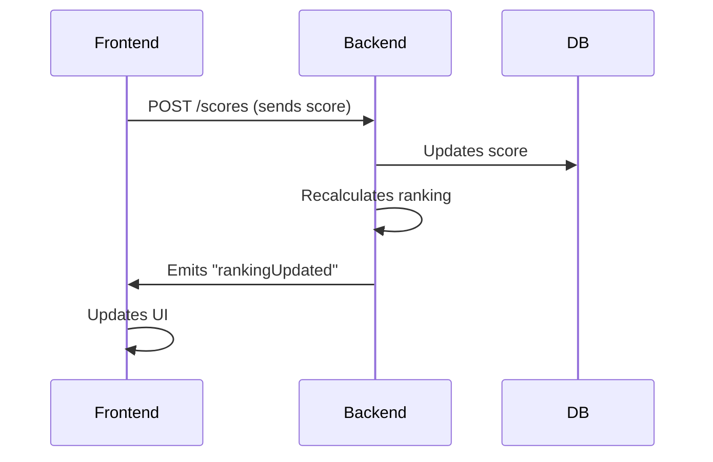

# 🎮 Trivia Game - Real-Time Questions and Answers with Live Ranking

<div>


</div>

## 📚 Tabla de Contenidos

- [Installation](#-installation)
- [Configuration](#-configuration)
- [Project Structure](#-estructura-del-proyecto)
- [WebSockets](#-websockets)
- [Technical Architecture](#-technical-architecture)
- [To do](#-to-do)
- [Licence](#-licence)

## 📥 Installation

### **Backend (NestJS)**

```bash
# 1. Clone the repository
git clone https://github.com/fierdimo/trivia.git

# 2. Navigate to the backend directory
cd trivia-backend

# 3. Install dependencies
npm install

# 4. Start a PostgreSQL container
docker-compose up -d

# 5. Start the server (development mode)
npm run dev

# 6. Access the API documentation
http://localhost:3000/api


```

### **Frontend (NextJS)**

```bash
# 1. From the root of the cloned directory...
cd trivia-frontend

# 2. Install dependencies
npm install

# 3. Start the application
npm run dev

# 4. Access the website
http://localhost:3001
```

## ⛏️ Configuration

Certain environment variables are required for the proper functioning of each part. This includes the PostgreSQL database in the backend and the default `admin` credentials. In the development environment, a `.env` file is required with the following:

### **Backend Environment Variables**

```bash
DB_HOST=localhost
DB_PORT=5432
DB_USER=postgres
DB_PASSWORD=your_secure_password
DB_NAME=trivia_db
JWT_SECRET=my_super_secure_secret_key
ADMIN_EMAIL=admin # Default admin email
ADMIN_PASSWORD=admin # Default admin password
```

### **Frontend Environment Variables**

```bash
BK_HOSTS=http://localhost:3000
```

## **🐳 Docker Containers**

Alternatively, the entire project can be installed using Docker Compose..

_From the root of the project, run `$ docker compose up -d`._

### **Estructura del proyecto**

```bash
trivia/
├── backend/
│   ├── src/
│   ├── .env # Only in development
│   ├── Dockerfile
│   └── package.json
├── frontend/
│   ├── src/
│   ├── .env # Only in development
│   ├── Dockerfile
│   └── package.json
├── README.MD
└── docker-compose.yml
```

**docker-compose.yml**

```bash
services:
  # PostgreSQL Database
  db:
    image: postgres:15-alpine
    container_name: trivia_db
    environment:
      POSTGRES_USER: postgres
      POSTGRES_PASSWORD: your_secure_password
      POSTGRES_DB: trivia_db
      ADMIN_EMAIL: admin
      ADMIN_PASSWORD: admin
    volumes:
      - postgres_data:/var/lib/postgresql/data
    ports:
      - "5432:5432"
    networks:
      - trivia_network

  # Backend (NestJS)
  backend:
    build:
      context: ./trivia-backend
      dockerfile: Dockerfile
    container_name: trivia_backend
    environment:
      DB_HOST: db
      DB_PORT: 5432
      DB_USER: postgres
      DB_PASSWORD: your_secure_password
      DB_NAME: trivia_db
      JWT_SECRET: jwt_secret_key
    ports:
      - "3000:3000"
    depends_on:
      - db
    networks:
      - trivia_network

  # Frontend (Next.js)
  frontend:
    build:
      context: ./trivia-frontend
      dockerfile: Dockerfile
    container_name: trivia_frontend
    environment:
      BK_HOSTS: http://backend:3000
    ports:
      - "3001:3000"
    depends_on:
      - backend
    networks:
      - trivia_network

# Volumes for data persistence
volumes:
  postgres_data:

# Network to connect services
networks:
  trivia_network:
    driver: bridge
```

## 📥 Project Structure

## **backend**

```bash
src/
├── auth/                     # JWT Authentication
│   ├── dto                   # Data Transfer Objects (DTOs) for authentication
│   │   └── login-user.ts     # DTO for user login
│   ├── jwt                   # JWT configuration and strategies
│   │   └── strategy.ts       # JWT authentication strategy
│   ├── guard.ts              # Guards (middlewares) to protect routes
│   ├── controller.ts         # Controller to handle authentication endpoints
│   ├── service.ts            # Business logic for authentication
│   └── module.ts             # Authentication module
│
├── questions/                # Question management
│   ├── entities              # Database entities
│   │   └── entity.ts         # Entity representing a question
│   ├── controller.ts         # Controller to handle question endpoints
│   ├── service.ts            # Business logic for questions
│   └── module.ts             # Questions module
│
├── scores/                   # Score management
│   ├── entities              # Database entities
│   │   └── entity.ts         # Entity representing a score
│   ├── controller.ts         # Controller to handle score endpoints
│   ├── service.ts            # Business logic for scores
│   └── module.ts             # Scores module
│
├── ranking/                  # WebSockets and ranking management
│   └── gateway.ts            # Socket.IO gateway for real-time communication
│   ├── service.ts            # Business logic for ranking
│   └── module.ts             # Ranking module
│
├── roles/                    # Role and permission management
│   ├── decorator.ts          # Custom role decorators
│   └── guard.ts              # Guards to verify roles and permissions
│
├── users/                    # User management
│   ├── entities              # Database entities
│   │   ├── uuid-param.ts     # DTO for UUID parameters
│   │   └── entity.ts         # Entity representing a user
│   ├── dto                   # Data Transfer Objects (DTOs) for users
│   │   └── register-user.ts  # DTO for user registration
│   ├── controller.ts         # Controller to handle user endpoints
│   ├── service.ts            # Business logic for users
│   └── module.ts             # Users module
│
├── app.module.ts             # Main application module
└── main.ts                   # Application entry point
```

## **frontend**

```bash
src/
├── components/            # Reusable UI components
│   ├── header.tsx         # Application header component
│   ├── loginBox.tsx       # Login form
│   ├── newQuestion.tsx    # Form to create new questions
│   ├── question.tsx       # Component to display a single question
│   ├── questions.tsx      # List of questions
│   └── ranking.tsx        # Component to display real-time ranking
│
├── context/               # React contexts for global state management
│   └── userContext.tsx    # Context to store user data
│
├── hooks/                 # Custom hooks
│   ├── useAuth.tsx        # Hook to handle authentication logic
│   ├── useCategories.tsx  # Hook to fetch and manage categories
│   ├── useQuestions.tsx   # Hook to fetch and manage questions
│   └── useRankings.tsx    # Hook to fetch and manage ranking
│
├── pages/                 # Application pages (Next.js routing)
│   ├── _app.tsx           # Main page wrapping the entire application (common layout)
│   ├── _document.tsx      # Customization of the base HTML document
│   ├── game/              # Pages related to the interactive game
│   │   ├── [newQuestion]  # Dialog to create new questions (Only for 'admin' user).
│   │   ├── [questions]    # Uses the `questions.tsx' component
│   │   ├── [categories]   # List of available question categories
│   │   └── [rankings]     # Uses the `ranking.tsx' component
│   └── index.tsx          # Home page (landing page)
│
├── styles/                # Global styles and CSS
│   └── globals.css        # Global styles file for the application
│
└── types/                 # TypeScript types and interfaces
    └── user.ts            # Definition of user-related types/interfaces
```

## ⚡ Websockets



### Explanation:

1. Frontend sends a score to the **Backend** via a `POST /scores` request.
2. The **Backend** updates the score in the database (**DB**).
3. The **Backend** recalculates the ranking..
4. The **Backend** emits a `"rankingUpdated"` event to the Frontend.
5. The **Frontend** updates the user interface **(UI)** with the new information.

### **Key Implementation**

#### Backend: ranking.gateway.ts

```bash
@WebSocketGateway({ cors: true })
export class RankingGateway {
  @WebSocketServer()
  server: Server;

  @SubscribeMessage('scoreUpdate')
  handleScoreUpdate() {
    this.server.emit('rankingUpdated', await this.getLatestRanking());
  }
}
```

#### Frontend: useRanking.ts

```bash
const socket = io(process.env.NEXT_PUBLIC_WS_URL!);

socket.on('rankingUpdated', (newRanking: RankingEntry[]) => {
  setRanking(newRanking);
});
```

## 🧠 Technical Architecture

### **Backend**

| Technology      | Purpose                   | Key Benefit Clave                     |
| --------------- | ------------------------- | ------------------------------------- |
| NestJS          | Main framework            | Modular and scalable architecture     |
| TypeORM         | ORM for PostgreSQL        | Advanced migrations and relationships |
| Socket.IO       | Real-time communication   | Low latency (~100ms)                  |
| Class-Validator | Data validation           | TypeScript-like schemas               |
| JWT             | Autenticación de usuarios | Espiración de la sesión               |

# **Frontend**

| Technology     |       Purpose        |        Key Benefit        |
| -------------- | :------------------: | :-----------------------: |
| Next.js 15     |   Hybrid rendering   |    Optimized SEO + ISR    |
| Axios          | API state management | Simple and consistent API |
| Material-UI v6 |    UI components     |     Responsive design     |

## 🛠️ To Do

The frontend design is still raw and only shows essential functionality. It is necessary to create user-friendly components and ensure compatibility with devices of different screen sizes (responsive design).

## 📜 License

This project is licensed under the terms of the MIT License


