# 🎮 Trivia Game - Preguntas y Respuestas con Ranking en Tiempo Real

<div align="center">
  
  
  
  
</div>

## 📚 Tabla de Contenidos

- [Instalación](#-instalación)
- [Configuración](#-configuración)
- [Estructura del Proyecto](#-estructura-del-proyecto)
- [WebSockets](#-websockets)
- [Endpoints API](#-endpoints-api)
- [Arquitectura Técnica](#-arquitectura-técnica)

## 📥 Instalación

### **Backend (NestJS)**

```bash
# 1. Clonar repositorio
git clone https://github.com/tu-usuario/trivia-backend.git
cd trivia-backend

# 2. Instalar dependencias
npm install

# 3. Configurar PostgreSQL con Docker
docker-compose up -d

# 4. Iniciar servidor (modo desarrollo)
npm run dev

# 5. Acceder a la documentación API
http://localhost:3000/api


```

### **Frontend (NextJS)**

```bash
# 1. Clonar repositorio
git clone https://github.com/tu-usuario/trivias.git
cd trivias

# 2. Instalar dependencias
npm install

# 3. Iniciar aplicación
npm run dev

# 4. Acceder al sitio web
http://localhost:3001
**nota: el backend debe encenderse primero para obtener el puerto 3001**
```

## ⛏️ Configuración

se requiere de ciertas variables de entorno para el correcto funcionamiento de cada una de las partes. esto incluye la base de datos en posgreSQL en el backend.

### **Variables de entorno backend**

```bash
DB_HOST=localhost
DB_PORT=5432
DB_USER=postgres
DB_PASSWORD=tu_password_seguro
DB_NAME=trivia_db
JWT_SECRET=mi_clave_secreta_super_segura
```

### **Variables de entorno fronted**

```bash
BK_HOSTS=http://localhost:3000
```

## **🐳 Contenedores en Docker**

de manera alternativa de puede instalar el proyecto completo con docker compose

### **Estructura del proyecto**

```bash
trivia/
├── backend/
│   ├── Dockerfile
│   ├── src/
│   └── package.json
├── frontend/
│   ├── Dockerfile
│   ├── src/
│   └── package.json
└── docker-compose.yml
```

**docker-compose.yml**

```bash
version: '3.8'

services:
  # Base de datos PostgreSQL
  db:
    image: postgres:15-alpine
    container_name: trivia_db
    environment:
      POSTGRES_USER: postgres
      POSTGRES_PASSWORD: tu_password_seguro
      POSTGRES_DB: trivia_db
    volumes:
      - postgres_data:/var/lib/postgresql/data
    ports:
      - "5432:5432"
    networks:
      - trivia_network

  # Backend (NestJS)
  backend:
    build:
      context: ./backend
      dockerfile: Dockerfile
    container_name: trivia_backend
    environment:
      DB_HOST: db
      DB_PORT: 5432
      DB_USER: postgres
      DB_PASSWORD: tu_password_seguro
      DB_NAME: trivia_db
      JWT_SECRET: clave_secreta_jwt
    ports:
      - "3000:3000"
    depends_on:
      - db
    networks:
      - trivia_network

  # Frontend (Next.js)
  frontend:
    build:
      context: ./frontend
      dockerfile: Dockerfile
    container_name: trivia_frontend
    environment:
      BK_HOSTS: http://backend:3000
    ports:
      - "3001:3000"
    depends_on:
      - backend
    networks:
      - trivia_network

# Volúmenes para persistencia de datos
volumes:
  postgres_data:

# Red para conectar los servicios
networks:
  trivia_network:
    driver: bridge
```

## 📥 Estructura del projecto

## **backend**

```bash
src/
├── auth/                     # Autenticación JWT
│   ├── dto                   # Objetos de transferencia de datos (DTOs) para autenticación
│   │   └── login-user.ts     # DTO para el inicio de sesión de usuarios
│   ├── jwt                   # Configuración y estrategias de JWT
│   │   └── strategy.ts       # Estrategia de autenticación JWT
│   ├── guard.ts              # Guards (middlewares) para proteger rutas
│   ├── controller.ts         # Controlador para manejar endpoints de autenticación
│   ├── service.ts            # Lógica de negocio para autenticación
│   └── module.ts             # Módulo de autenticación
│
├── questions/                # Gestión de preguntas
│   ├── entities              # Entidades de base de datos
│   │   └── entity.ts         # Entidad que representa una pregunta
│   ├── controller.ts         # Controlador para manejar endpoints de preguntas
│   ├── service.ts            # Lógica de negocio para preguntas
│   └── module.ts             # Módulo de preguntas
│
├── scores/                   # Gestión de resultados
│   ├── entities              # Entidades de base de datos
│   │   └── entity.ts         # Entidad que representa un resultado
│   ├── controller.ts         # Controlador para manejar endpoints de resultados
│   ├── service.ts            # Lógica de negocio para resultados
│   └── module.ts             # Módulo de resultados
│
├── ranking/                  # WebSockets y gestión de ranking
│   └── gateway.ts            # Gateway de Socket.IO para comunicación en tiempo real
│   ├── service.ts            # Lógica de negocio para el ranking
│   └── module.ts             # Módulo de ranking
│
├── roles/                    # Gestión de roles y permisos
│   ├── decorator.ts          # Decoradores personalizados para roles
│   └── guard.ts              # Guards para verificar roles y permisos
│
├── users/                    # Gestión de usuarios
│   ├── entities              # Entidades de base de datos
│   │   ├── uuid-param.ts     # DTO para parámetros UUID
│   │   └── entity.ts         # Entidad que representa un usuario
│   ├── dto                   # Objetos de transferencia de datos (DTOs) para usuarios
│   │   └── register-user.ts  # DTO para el registro de usuarios
│   ├── controller.ts         # Controlador para manejar endpoints de usuarios
│   ├── service.ts            # Lógica de negocio para usuarios
│   └── module.ts             # Módulo de usuarios
│
├── app.module.ts             # Módulo principal de la aplicación
└── main.ts                   # Punto de entrada de la aplicación
```

## **frontend**

```bash
src/
├── components/            # Componentes reutilizables de la UI
│   ├── header.tsx         # Componente del encabezado de la aplicación
│   ├── loginBox.tsx       # Formulario de acceso (login)
│   ├── newQuestion.tsx    # Formulario para crear nuevas preguntas
│   ├── question.tsx       # Componente que muestra una pregunta individual
│   ├── questions.tsx      # Listado de preguntas
│   └── ranking.tsx        # Componente que muestra el ranking de puntuaciones en tiempo real
│
├── context/               # Contextos de React para manejo de estado global
│   └── userContext.tsx    # Contexto para almacenar datos del usuario
│
├── hooks/                 # Hooks personalizados
│   ├── useAuth.tsx        # Hook para manejar la lógica de autenticación
│   ├── useCategories.tsx  # Hook para obtener y gestionar categorías
│   ├── useQuestions.tsx   # Hook para obtener y gestionar preguntas
│   └── useRankings.tsx    # Hook para obtener y gestionar el ranking de puntuaciones
│
├── pages/                 # Páginas de la aplicación (enrutamiento de Next.js)
│   ├── _app.tsx           # Página principal que envuelve toda la aplicación (layout común)
│   ├── _document.tsx      # Personalización del documento HTML base
│   ├── game/              # Páginas relacionadas con el juego interactivo
│   │   ├── [newQuestion]  # Dialogo para crear nuevas preguntas (Solo usuario 'admin).
│   │   ├── [questions]    # Usa el componente `questions.tsx'
│   │   ├── [categories]   # Lista de categorías disponibles para preguntas
│   │   └── [rankings]     # Usa el componente `ranking.tsx'
│   └── index.tsx          # Página de inicio (landing page)
│
├── styles/                # Estilos globales y CSS
│   └── globals.css        # Archivo de estilos globales para la aplicación
│
└── types/                 # Tipos y interfaces de TypeScript
    └── user.ts            # Definición de tipos/interfaces relacionados con el usuario
```

## ⚡ Websockets - flujo en tiempo real

```mermaid
sequenceDiagram
participant Frontend
participant Backend
participant DB

    Frontend->>Backend: POST /scores (envía puntaje)
    Backend->>DB: Actualiza puntuación
    Backend->>Backend: Recalcula ranking
    Backend->>Frontend: Emite "rankingUpdated"
    Frontend->>Frontend: Actualiza UI
```



### Explicación:

1. **Frontend** envía un puntaje al **Backend** mediante una solicitud `POST /scores`.
2. El **Backend** actualiza la puntuación en la base de datos (**DB**).
3. El **Backend** recalcula el ranking.
4. El **Backend** emite un evento `"rankingUpdated"` al **Frontend**.
5. El **Frontend** actualiza la interfaz de usuario (**UI**) con la nueva información.

## **Implementación clave**

### Backend: ranking.gateway.ts

```bash
@WebSocketGateway({ cors: true })
export class RankingGateway {
  @WebSocketServer()
  server: Server;

  @SubscribeMessage('scoreUpdate')
  handleScoreUpdate() {
    this.server.emit('rankingUpdated', await this.getLatestRanking());
  }
}
```

### Frontend: useRanking.ts

```bash
const socket = io(process.env.NEXT_PUBLIC_WS_URL!);

socket.on('rankingUpdated', (newRanking: RankingEntry[]) => {
  setRanking(newRanking);
});
```

## 🧠 Arquitectura Técnica

### **Backend**

| Tecnología      | Propósito                   | Beneficio Clave                    |
| --------------- | --------------------------- | ---------------------------------- |
| NestJS          | Framework principal         | Arquitectura modular y escalable   |
| TypeORM         | ORM para PostgreSQL         | Migraciones y relaciones avanzadas |
| Socket.IO       | Comunicación en tiempo real | Bajo latency (~100ms)              |
| Class-Validator | Validación de datos         | Schemas tipo TypeScript            |

## **Frontend**

| Tecnología     |           Propósito            |     Beneficio Clave     |
| -------------- | :----------------------------: | :---------------------: |
| Next.js 13     |      Renderizado híbrido       |  SEO optimizado + ISR   |
| React Query    |     Gestión de estado API      |   Caching automático    |
| Material-UI v6 |         Componentes UI         |    Diseño responsive    |
| SWR            | Actualizaciones en tiempo real | Revalidación automática |
